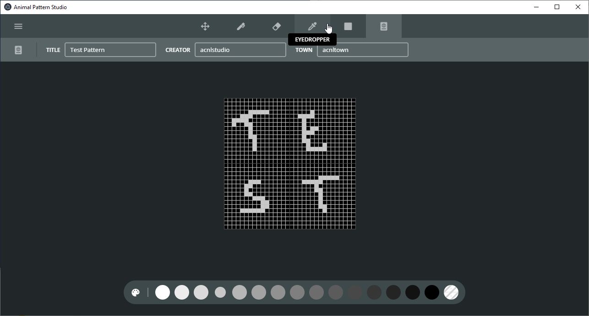
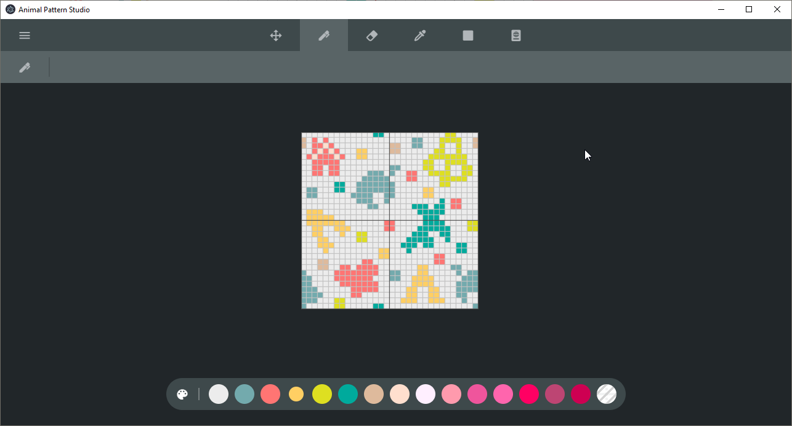
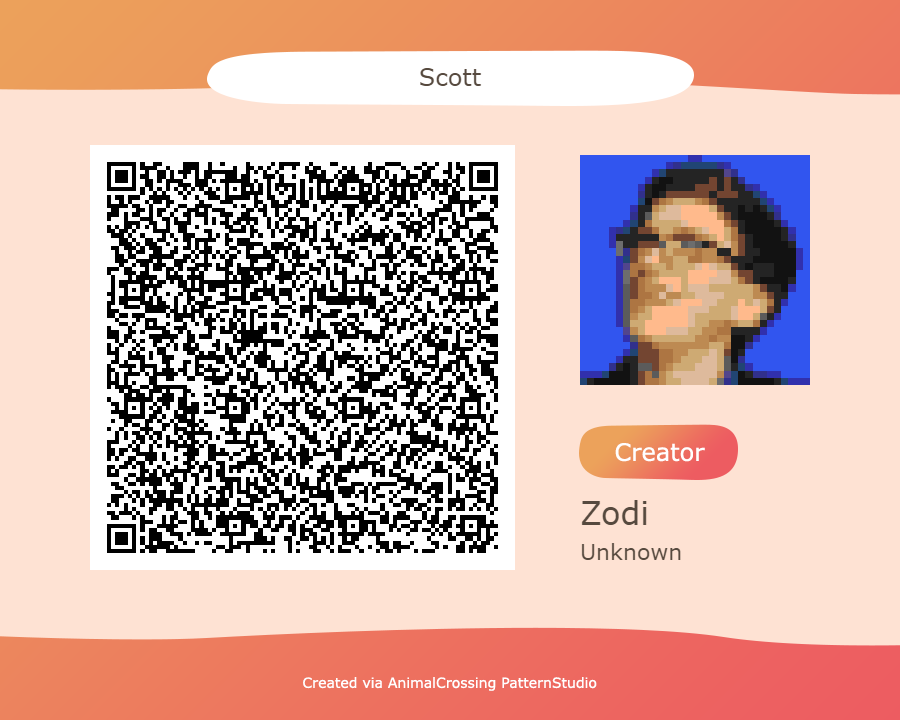

# Animal Crossing Pattern Studio
This application is a fully featured design suite for your Animal Crossing patterns. You can import files from existing pattern websites, scan a QR code or start with a new pattern. Export your patterns as QR codes or binary files for other tools and the games scanner functionality.

## Screenshots

## Download
This application is currently under development. Download a copy of this repo and execute **npm install** as well as **npm run start** to try it out for yourself!

## Contribution
We'd love for you to help us out! Check out the issues for things you can work on right away! More information will be available later on!